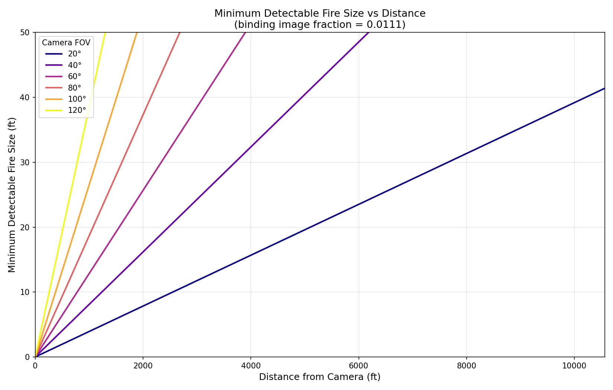

# Fire_v1 — Benchmark Report

## Executive Summary

| Metric | Value (All Confidence Tiers) |
|---|---|
| Cumulative Detection Accuracy (DA)   | **97.4%** |
| Cumulative False Alarm Rate (FAR)    | **8.7%** |
| Cumulative False Negative Rate (FNR) | **2.6%** |

### Image Dataset

> 📁 **All benchmark images** are available in the shared Google Drive folder:  
> _[Click Here](https://drive.google.com/drive/folders/14OubrayWplr4q6U6DTNwUk5Nlvmj4ITc?usp=sharing)_

### Distance Study Highlights (80° FOV)

- **1-inch fire** at 80° FOV: detectable up to **4 ft**
- **15 ft fire** at 80° FOV: detectable up to **804 ft**
- **30 ft fire** at 20° FOV: detectable up to **7,656 ft (1.45 miles)**

---

## Methodology

### Detection Study

Three datasets were evaluated as **detection studies** (Fire, Fire\_Thermal, Wildfire).  
Each dataset provides two splits:

- **Final images** — original frames with fire/smoke present. Used to measure  
  **Detection Accuracy (DA)** and **False Negative Rate (FNR)**.
- **Blackout images** — the same frames with the labelled objects blacked out.  
  Used to measure the **False Alarm Rate (FAR)**, since any detection in these  
  images is by definition a false alarm.

#### Metrics

| Metric | Definition |
|---|---|
| **DA**  | `TP / (TP + FN)` — fraction of ground-truth boxes matched by at least one prediction with IOU ≥ 0.0001 (effectively any overlap) |
| **FAR** | `images with ≥1 prediction / total blackout images` — proportion of blackout images that trigger at least one false detection |
| **FNR** | `FN / (TP + FN) = 1 − DA` — fraction of ground-truth boxes missed by the model |

Results are reported **cumulatively by confidence tier** — each tier includes all boxes  
at that level and above:

| Tier | Levels included |
|---|---|
| Highest              | `highest` only |
| Highest + High       | `highest`, `high` |
| Highest + High + Med | `highest`, `high`, `medium` |
| All                  | `highest`, `high`, `medium`, `low` |

A ground-truth box is considered **matched** (TP) if any predicted box in the same  
image has IOU ≥ 0.0001 with it (effectively any bounding-box overlap),  
regardless of class label (since terms vary per dataset). A single predicted box may  
overlap multiple GT boxes, and each overlapping GT box is counted as a separate TP.  
DA and FNR are computed from normal images only; blackout images do not contribute  
to these metrics.

### Distance Study

One dataset (Fire\_Distance) is treated as a **distance study**. The methodology is:

1. Identify the smallest ground-truth bounding box (by area) for which the model  
   produced at least one prediction with IOU > 0.
2. Record its normalised width and height as the **minimum detectable image fraction**.
3. Apply the FOV formula (see Distance Study section below) to compute maximum  
   detection distances for any combination of camera FOV and fire size.

---

## Detection Study Results

### Cumulative (All Datasets)

| Confidence Tier | DA | FAR | FNR | Total TP | Total FN |
|---|---|---|---|---|---|
| Highest | 4.5% | 0.0% | 95.5% | 28 | 593 |
| High | 15.8% | 0.0% | 84.2% | 98 | 523 |
| Medium | 95.3% | 8.7% | 4.7% | 592 | 29 |
| Low | 97.4% | 8.7% | 2.6% | 605 | 16 |

---

### Per-Dataset Results

### Fire

_Source: [https://universe.roboflow.com/sean-cftrp/fire-z2n21](https://universe.roboflow.com/sean-cftrp/fire-z2n21)_

| Confidence Tier | DA | FAR | FNR | TP | FN | Blackout Images | False Alarms |
|---|---|---|---|---|---|---|---|
| Highest | 11.4% | 0.0% | 88.6% | 28 | 217 | 23 | 0 |
| High | 40.0% | 0.0% | 60.0% | 98 | 147 | 23 | 0 |
| Medium | 96.3% | 0.0% | 3.7% | 236 | 9 | 23 | 0 |
| Low | 98.8% | 0.0% | 1.2% | 242 | 3 | 23 | 0 |

### Fire_Thermal

_Source: [https://universe.roboflow.com/surveillance-rtj0v/fire-thermal](https://universe.roboflow.com/surveillance-rtj0v/fire-thermal)_

| Confidence Tier | DA | FAR | FNR | TP | FN | Blackout Images | False Alarms |
|---|---|---|---|---|---|---|---|
| Highest | 0.0% | 0.0% | 100.0% | 0 | 200 | 46 | 0 |
| High | 0.0% | 0.0% | 100.0% | 0 | 200 | 46 | 0 |
| Medium | 100.0% | 13.0% | 0.0% | 200 | 0 | 46 | 6 |
| Low | 100.0% | 13.0% | 0.0% | 200 | 0 | 46 | 6 |

### Wildfire

_Source: [https://universe.roboflow.com/insa-ausjd/wildfire-v7dbx](https://universe.roboflow.com/insa-ausjd/wildfire-v7dbx)_

| Confidence Tier | DA | FAR | FNR | TP | FN | Blackout Images | False Alarms |
|---|---|---|---|---|---|---|---|
| Highest | 0.0% | N/A | 100.0% | 0 | 176 | 0 | 0 |
| High | 0.0% | N/A | 100.0% | 0 | 176 | 0 | 0 |
| Medium | 88.6% | N/A | 11.4% | 156 | 20 | 0 | 0 |
| Low | 92.6% | N/A | 7.4% | 163 | 13 | 0 | 0 |


---

## Distance Study — Fire_Distance

### Smallest Detected Ground Truth Box

The smallest ground-truth bounding box for which the model produced a prediction  
with IOU > 0.05 has the following normalised dimensions:

| Dimension | Value |
|---|---|
| Width  (fraction of image) | `0.011979` |
| Height (fraction of image) | `0.011111` |
| Binding constraint (`min`) | `0.011111` |

#### FOV Formula

Given:
- **Object size** = `S` (ft)  
- **Distance** = `D` (ft)  
- **Minimum detectable image fraction** = `f` (dimensionless, 0–1)

The **maximum FOV** at which the object still subtends at least `f` of the image:

```
FOV = 2 × arctan( S / (2 × D × f) )
```

Solving for the **maximum detection distance** at a given FOV:

```
D_max = S / (2 × tan(FOV/2) × f)
```

And the **minimum detectable object size** at a given FOV and distance:

```
S_min = 2 × D × tan(FOV/2) × f
```

This is derived independently for the horizontal (width, f = 0.011979) and vertical  
(height, f = 0.011111) dimensions. The **binding constraint is the smaller**:  
`f_binding = min(w_gt, h_gt) = 0.011111`.

All table and chart values use `f_binding`.


### Maximum Detection Distance Table

Rows = camera FOV; columns = fire size.

| FOV (°) | 1" (0.0833 ft) | 15 ft | 1 ft | 5 ft | 10 ft | 30 ft |
|---| --- | --- | --- | --- | --- | --- |
| 20° | 21 ft | 3,828 ft | 255 ft | 1,276 ft | 2,552 ft | 7,656 ft |
| 40° | 10 ft | 1,855 ft | 124 ft | 618 ft | 1,236 ft | 3,709 ft |
| 60° | 6 ft | 1,169 ft | 78 ft | 390 ft | 779 ft | 2,338 ft |
| 80° | 4 ft | 804 ft | 54 ft | 268 ft | 536 ft | 1,609 ft |
| 100° | 3 ft | 566 ft | 38 ft | 189 ft | 378 ft | 1,133 ft |
| 120° | 2 ft | 390 ft | 26 ft | 130 ft | 260 ft | 779 ft |

### FOV Gradient Chart

Each line shows the **minimum detectable fire size** at a given distance for a specific camera FOV.  
Objects above the line for a given FOV can be detected; objects below cannot.




---

## Dataset Citations

| Dataset | Source |
|---|---|
| **Fire** | [https://universe.roboflow.com/sean-cftrp/fire-z2n21](https://universe.roboflow.com/sean-cftrp/fire-z2n21) |
| **Fire_Thermal** | [https://universe.roboflow.com/surveillance-rtj0v/fire-thermal](https://universe.roboflow.com/surveillance-rtj0v/fire-thermal) |
| **Wildfire** | [https://universe.roboflow.com/insa-ausjd/wildfire-v7dbx](https://universe.roboflow.com/insa-ausjd/wildfire-v7dbx) |
| **Fire_Distance** | _no public source_ |

